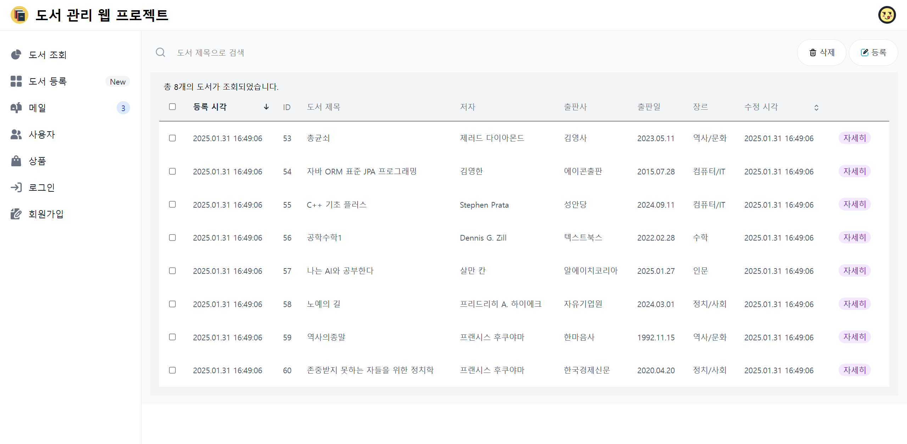
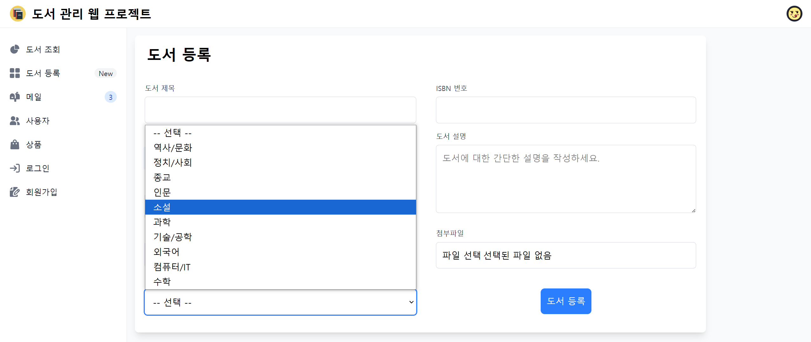

# Book-Manage-Springboot



SpringBoot를 이용한 도서 관리 웹 프로젝트 입니다.

제작기간 (24/01/24 - 24/01/31)


## 특징

* 도서 등록/조회/수정/삭제에 대한 기본적인 CRUD 제공

* 특정 도서에 대한 상세보기와 검색 기능 제공

* 체크박스를 이용한 도서 일괄 관리 기능 제공

* REST API와 Multipart를 이용한 도서 이미지 첨부 기능 제공

* HikariCP와 JPA를 이용한 데이터베이스 연동

  

## 기술 스택

* Spring Boot

* Mybatis (DB - MariaDB)

* Thymeleaf

* Tailwind CSS

  

## 데이터베이스 기본 설정

```sql
CREATE DATABASE springbootdb; -- 먼저 springbootdb 데이터베이스를 생성한 후 그안에 테이블을 생성하세요

CREATE TABLE Books (
    book_id BIGINT AUTO_INCREMENT PRIMARY KEY, -- 고유 식별자
    title VARCHAR(255) NOT NULL,               -- 도서 제목
    author VARCHAR(255) NOT NULL,              -- 저자
    publisher VARCHAR(255),                    -- 출판사
    published_date DATE,                       -- 출판일
    genres VARCHAR(255),                       -- 장르
    isbn VARCHAR(20) UNIQUE,                   -- ISBN 번호
    description TEXT,                          -- 도서 설명
    created_at TIMESTAMP DEFAULT CURRENT_TIMESTAMP, -- 생성 시각
    updated_at TIMESTAMP DEFAULT CURRENT_TIMESTAMP ON UPDATE CURRENT_TIMESTAMP -- 수정 시각
);

CREATE TABLE BookImages (
    image_id BIGINT AUTO_INCREMENT PRIMARY KEY,     -- 고유 식별자
    book_id BIGINT NOT NULL,                        -- 도서와의 외래 키 관계
    image_url VARCHAR(500) NOT NULL,                -- 이미지 URL
    created_at TIMESTAMP DEFAULT CURRENT_TIMESTAMP, -- 생성 시각
    FOREIGN KEY (book_id) REFERENCES Books(book_id) ON DELETE CASCADE -- 도서 삭제 시 이미지도 삭제
);

-- 장르 => 역사/문화, 정치/사회, 종교, 인문, 소설, 과학, 기술/공학, 외국어, 컴퓨터/IT, 수학

insert into t_book (title,author,publisher,published_date,genres,isbn,description,created_at,updated_at) values 
("총균쇠","제러드 다이아몬드", "김영사" , "2023-05-11" , "역사/문화" , "9788934942467", "총,균,쇠 인간사회의 운명을 바꾼힘",NOW(),NOW());

insert into t_book (title,author,publisher,published_date,genres,isbn,description,created_at,updated_at) values 
("자바 ORM 표준 JPA 프로그래밍","김영한", "에이콘출판" , "2015-07-28" , "컴퓨터/IT" , "9788960777330", "자바 ORM 표준 JPA는 SQL 작성 없이 객체를 데이터베이스에 직접 저장할 수 있게 도와주고, 객체와 관계형 데이터베이스의 차이도 중간에서 해결해준다." ,NOW(),NOW());

insert into t_book (title,author,publisher,published_date,genres,isbn,description,created_at,updated_at) values 
("C++ 기초 플러스","Stephen Prata", "성안당" , "2024-09-11" , "컴퓨터/IT" , "9788931555356", "최신 C++11 버전 포함 6판",NOW(),NOW());

insert into t_book (title,author,publisher,published_date,genres,isbn,description,created_at,updated_at) values 
("공학수학1","Dennis G. Zill", "텍스트북스" , "2022-02-28" , "수학" , "9791191679076", "이 공학수학은 Dennis G. Zill이 저술한 Advanced Engineering Mathematics, 7th ediition을 한국어판으로 출판한 책이다.",NOW(),NOW());
insert into t_book (title,author,publisher,published_date,genres,isbn,description,created_at,updated_at) values 
("나는 AI와 공부한다","살만 칸", "알에이치코리아" , "2025-01-27" , "인문" , "9788925574103", "우리가 알고 있는 교육의 종말",NOW(),NOW());

insert into t_book (title,author,publisher,published_date,genres,isbn,description,created_at,updated_at) values 
("노예의 길","프리드리히 A. 하이에크", "자유기업원" , "2024-03-01" , "정치/사회" , "9788984292987", "사회주의 계획경제의 진실",NOW(),NOW());

insert into t_book (title,author,publisher,published_date,genres,isbn,description,created_at,updated_at) values 
("역사의종말","프랜시스 후쿠야마", "한마음사" , "1992-11-15" , "역사/문화" , "9788978000468", "동유럽 공산주의가 흔들릴 무렵 이데올로기 대립은 끝났다고 선언, 뜨거운 역사철학논쟁을 불러일으켰던 프랜시스 후쿠야마의 역사철학서.",NOW(),NOW());
insert into t_book (title,author,publisher,published_date,genres,isbn,description,created_at,updated_at) values 
("존중받지 못하는 자들을 위한 정치학","프랜시스 후쿠야마", "한국경제신문" , "2020-04-20" , "정치/사회" , "9788947545815", "존엄에 대한 요구와 분노의 정치에 대하여",NOW(),NOW());

```


## 스크린샷




